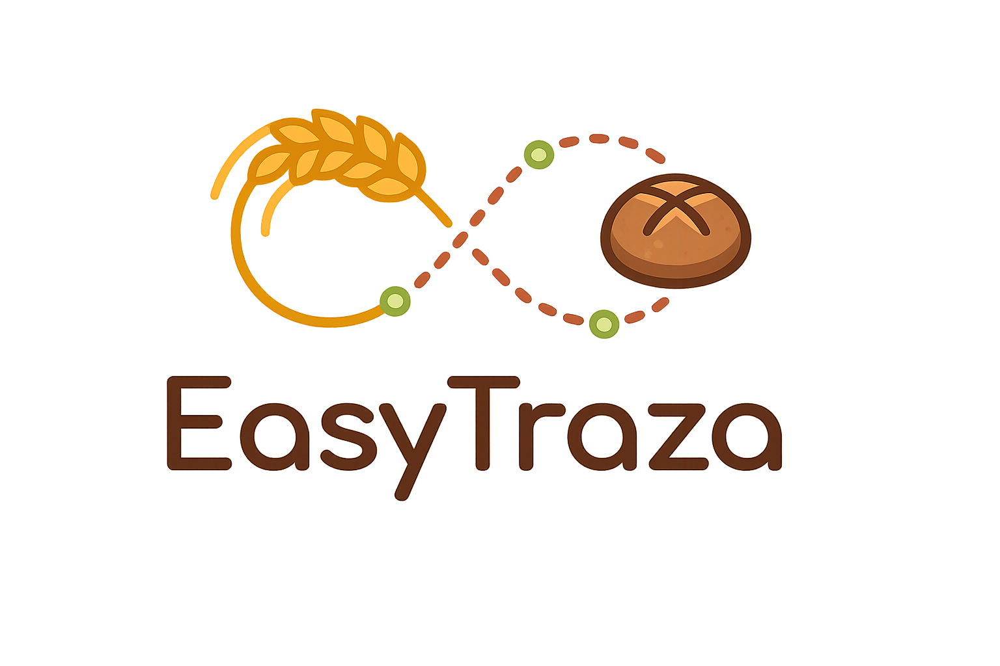

= EasyTraza
Eric Delgado López
:toc:
:toc-title: Índex
:toclevels: 3
:sectnums:
:icons: font
:lang: ca

== Descripció del projecte

EasyTraza és una aplicació multiplataforma amb arquitectura client-servidor orientada a la gestió de la traçabilitat alimentària dins d’un obrador o entorn de producció.

L’objectiu principal del projecte és digitalitzar processos que habitualment es gestionen de forma manual, com ara la recepció d’albarans, el control de lots de matèries primeres, la consulta de proveïdors, clients i productes, i el seguiment de la informació necessària per respondre davant possibles incidències.

El sistema està format per tres blocs principals:

* un *backend* desenvolupat amb *Spring Boot*, encarregat de la lògica de negoci, la persistència de dades i l’exposició de serveis REST;
* un *client web* desenvolupat amb *HTML, CSS i Thymeleaf*, pensat per a la gestió administrativa i la consulta de dades des d’ordinador;
* un *client mòbil* desenvolupat amb *Kotlin i Jetpack Compose*, orientat a facilitar operacions àgils en el context de treball, com la recepció d’albarans i el suport al procés OCR.

== Funcionalitats principals

Entre les funcionalitats principals del projecte destaquen:

* Gestió d’usuaris, proveïdors, matèries primeres, productes i clients.
* Registre i consulta d’albarans de proveïdor.
* Recepció de lots associats a matèries primeres.
* Suport OCR per extreure informació d’albarans de manera assistida.
* Revisió i correcció manual de les dades detectades abans de confirmar-ne el registre.
* Gestió de l’estat dels lots, incloent-ne l’inici i la finalització.
* Consulta i filtratge d’informació des del client web.
* Connexió entre el backend i el client mòbil mitjançant API REST.
* Suport multidioma en castellà i català.

== Tecnologies utilitzades

=== Backend

* Java
* Spring Boot
* Maven
* Spring MVC
* Spring Data JPA
* Hibernate
* MySQL

=== Client web

* HTML
* CSS
* JavaScript
* Thymeleaf

=== Client mòbil

* Kotlin
* Jetpack Compose
* Retrofit
* DataStore
* ViewModel
* StateFlow

=== Altres eines i recursos

* Git
* GitLab
* AsciiDoc
* Figma
* Tesseract OCR

== Estructura del repositori

[source]
----
Projecte4_Eric_EasyTraza/
├── backend/
├── mobile/
├── documentacio/
└── README.adoc
----

=== Carpetes principals

[cols="1,4", options="header"]
|===
| Carpeta | Descripció

| `backend/`
| Aplicació Spring Boot, controladors web i REST, serveis, repositoris, entitats, plantilles Thymeleaf, recursos estàtics i configuració del sistema.

| `mobile/`
| Aplicació Android desenvolupada amb Kotlin i Jetpack Compose, connectada al backend mitjançant Retrofit.

| `documentacio/`
| Documentació funcional i tècnica del projecte, memòria, seguiment dels sprints, imatges, captures i fitxers AsciiDoc.

| `README.adoc`
| Fitxer principal de presentació del repositori.
|===

== Documentació

La documentació del projecte es troba dins de la carpeta:

[source]
----
documentacio/
----

Aquesta documentació inclou:

* la memòria general del projecte;
* la recollida de requisits i el disseny inicial;
* la documentació de seguiment dels sprints;
* els daily stand-ups;
* les planificacions inicials i finals de cada sprint;
* les retrospectives personals;
* captures del board de GitLab i altres recursos visuals.

== Vídeo del projecte

L’enllaç al vídeo de demostració del projecte s’afegirà quan estigui disponible.

[source]
----
PENDENT
----

== Autor

[cols="1,3", options="header"]
|===
| Camp | Valor

| Nom
| Eric Delgado López

| Projecte
| EasyTraza

| Curs
| 2DAM

| Any acadèmic
| 2025-2026

| Centre
| Institut Nicolau Copernic
|===